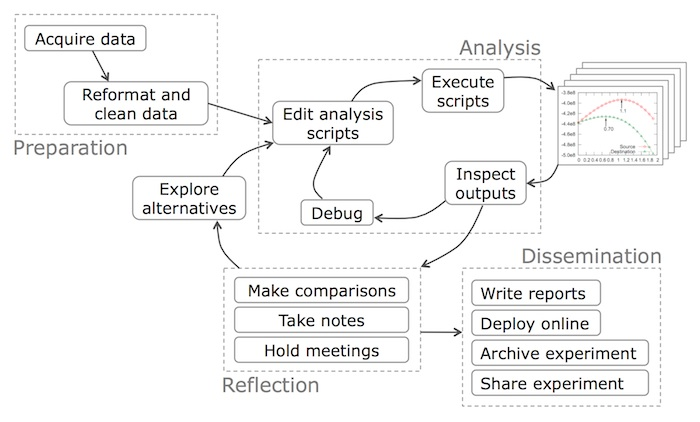
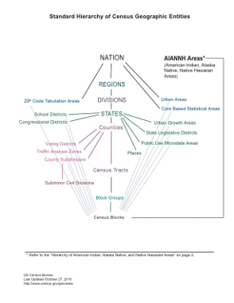

# Class Overview

## Basics

 -   I'm Jamaal Green
 -   Doctoral candidate here at USP, specializing in economic development
 -   I'm a baby "data scientist" and avid R user
 -   I work with A LOT of different types of data, particularly census and regional economic data

##  What I'm hoping for...

 -   That we develop a more sophisticated **workflow** that will allow us to approach data analysis problems in a consistent way

 -   Make our work more consistent, easier to review and replicable

 -   Use R as our base of operations for this. Not everything we do will or can be done in R, but R is a convenient environment for anchoring for data analytic work

## What do you mean by workflow?

[Philip Guo, 2013](https://cacm.acm.org/blogs/blog-cacm/169199-data-science-workflow-overview-and-challenges/fulltext)

## But really more like this...

[Grolemund and Wickham, 2018](https://r4ds.had.co.nz/introduction.html)

## Okay...but why R? I'm not a coder/scripter/programmer/data scientist etc...

R provides us a platform to do most anything we have to do in the process of our workflow- this includes visualization and report writing. 

Even at times when R is not sufficient, we can always come back to R.

Also...R is free.

## But why (again)

Scripting allows us to better track what we've done...this means

- Easier to correct mistakes because every step is documented
- Easier to modify analyses without starting over
- Scripting is in demand for the jobs you all are aiming for (particularly the planners)
- R is free

# Intro to Regional Economic Data Sources

## What are we trying to do?

* What are the economic conditions that exist in my region?
* What are the resources that exist to support my regional economy?
  + Labor and human capital
  + Businesses/Institutions
  + Natural resourcs/infrastructure...even entrepreneuralism and innovation
  
##  Starting with the question...

What are some questions one would ask in analyzing how important, or not, manufacturing is to your region?

- Employment? Change over time? How does this compare to other regions?
- Firm structure? Dominated by big or small firms?
- How much income can we attribute to manufacturing? What are the good occupations within that industry?

## Evaluating usefulness of data sources

- Provenance...where is it from? Is it trustworthy?
- Collection...how big is the sample? How was it collected? 
- What are the appropriate geographies and/or time periods?
- Is this primary/secondary?

##  Different data sources

* Most of our data will be public...specifically federal
  + BLS, BEA, Census etc
* Proprietary data sources do exist...are usually quite expensive
  + NETS, InfoUSA (NETS is also longitudinal)
* Primary vs secondary sources
  + a question of convenience, need, flexibility...we may use some in this class
  
## Some types of data we will work with 

* Administrative records- collected for a specific purpose and often subject to disclosure rules
* Surveys- collected to answer some set of research questions
  + What was the sampling strategy? Overall sample size? Estimated bias?

##  Some key concepts

* Employment vs. jobs
  + What is a person's employment *status* versus what jobs they may hold? People can have more than one job
* Place of residence vs place of work...
* Seasonal and inflation adjustments

## Data Frequency

* How often is your data collect? Released?
* American COmmunity Survey (ACS)
  + Collected continuously, rolled up into multiyear samples
* Decennial Census* 10 years
* Economic Census* 5 years
* Quarterly Census of Employment and Wages
* What is the time lag on releases? When should you expect them?

## Data compatible over time?

* Historical data is often very difficult to get
* Major barriers include
  + Basic availability...did the data exist? is it in a machine readable format?
  + Code Changes...SIC to NAICS and change within NAICS
  + Changes in how variables are defined over time

## How are the data organized?

* Classification/organization systems are important to be familiar with
  + NAICS vs SIC
  + Standard occupational codes (SOC)
  + Metropolitan vs micropolitan areas
  + Race/ethnicity
  
## Geographic Detail

Can you get your data at the scale you need? Note that bigger units like states/metro areas are easier to get rich economic data than say tracts or even cities (places in census parlance)

##  Census geographies

[US Census, 2015](https://www2.census.gov/geo/pdfs/reference/geodiagram.pdf)

# Data Sources

## The Big Three

- US Census
- Bureau of Labor Statistics (BLS)
- Bureau of Economic Analysis (BEA)

## Local Go-To

State Labor Markt Information Angency (e.g. Oregon Employment Department)

Other local affiliaties...PRC, IMS for one

## Some helpful portals

Social Explorer

HUD State of the Cities

FRED (Federal Reserve Economic Data)

Fedstats.gov

Econdata.net

## US Census Bureau

- Decennial and ACS
- Economic Census (collected on years ending in 2 and 7)
- County Business patterns
- Longitudinal Household-Employer Dynamics (LEHD) Program

## Bureau of Labor Statistics

* Primarily statistics related to employment, unemployment and wages
* Mix of geographies from national to county
  + Monthly payroll employment (CES)
  + Quarterly establishment and employment by industry (QCEW)
  + Local area unemployment and employment (LAUS)
  + Annual empoyment and wages by occupation

##  Bureau of Economic Analysis

Regional data section

- State/metro measures of GDP
- Personal income
- Employment by industry (based on BLS QCEW)
- Commuting pattern data from Census
- Regional Input-Output Modeling System (RIMS)

##  State LMI Agencies

- Agencies collect and produce data base don BLS protocols
- Oregon Employment department- [qualityinfo.org](https://www.qualityinfo.org/)
- Similar datapoints but offer additional info or research, on occasion
- Know your state employment data provider: [https://www.bls.gov/bls/ofolist.htm](https://www.bls.gov/bls/ofolist.htm)

## Secondary sites and APIs

Social explorer- PSU has subscription, offers census data and some rudimentary mapping support

API- Application Programming Interface
  - Query different federal datasets from R over the internet
  - Remember to applyfor your census API key. [Key Request](https://api.census.gov/data/key_signup.html)

R packages that query data are often convenience wrappers for APIs (tidycensus, censusapi)

## Coming back to our questions?

Answering questions about our economies  requires facility and familiarity with multiple data sources. So, it's important to know where to start looking. 