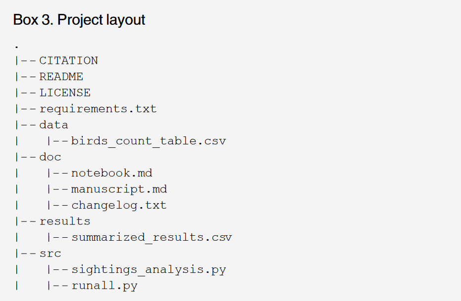

```{r setup, include=FALSE}
knitr::opts_chunk$set(echo = FALSE)
if(!require(pacman)){install.packages("pacman"); library(pacman)}
p_load(dplyr, tibble, kableExtra)
```

# Introduction

## Some motivating questions

- What kinds of demographic data are important for understanding the regional economy?

- Why do we study demography and the economy at the MSA level?

- Highlight some key demographic concepts

- Review sources of demographic data

## Why do we need to examine demographic data?

Population attributes have clear ramifications for one's economy and population are both a reflection of and cause of economic growth or decline. 

How old is your population? How young? How educated? Is population growing or not? How is it growing?

## An Example

[Greater Portland Inc's Economic Development strategy:](https://www.greaterportlandinc.com/assets/documents/GP2020%20CEDS.pdf)

- Focus on workforce composition
- Public primary and secondary education
- Workforce concerns


# Demographic Concepts

##  Some important questions

> - How many people live here and how is that changing?
> - Where did they come from?
> - How old are the people here and where do they work?
> - What is the education level of our population?
> - Race/ethnicity
> - Are people looking for work?

##  Some important concepts { .smaller}

- Counts or "enumeration" vs estimates vs forecasts
- Households vs persons vs families
  + *Family*- "a group of two or more people (one of whom is the householder) related by birth, marriage, or adoption and residing together; all such people (including related subfamily members) as considered as members of one family"
  + *Household*- one or more people who occupy a housing unit
- Fertility: *Total Fertility Rate* = the average number of children that would be born to a woman in her lifetime. Calculated as the sum of age-specific fertility rates.
- Mortality Rate: Deaths per adults per unit of time
- Migration: movement of people from one place to another
- Population Growth: Births - Deaths + Net Migration
- Race and ethnicity
- Census geography

## Demographic data sources

- US Census Bureau
  + Decennial census for counts
  + Population estimates program
  + Population projections
  + ACS
  + Small Area Income and Poverty Estimates

## Decennial Census

- Short form
  + Questions asked of all persons residing in US
    - Age, gender, race/ethnicity/Hispanic status, household relationship, housing tenure
    - 100% data products
- Long Form
  + Questions asked for  1 out of 6  housing units...approx. 15% of the population  in 2000
    - Economic, social and housing information
    - Sample data products
    
Note: ACS has largely replaced the long form census. 

## Race/Ethnicity

Be careful. 

- Race is NOT ethnicity. 
- Hispanics can be members of ANY RACE.
- Race is a *social category* where meaning has shifted over time and shifts over *regionally*
  + e.g. in PDX, more Aftican-Americans identify as multi-racial than African-American alone (nearly 10x more) 
  
##  American Community Survey

- Ongoing survey collected from about 2.3 million households, or a 1.7% sample

- Aggregated in 1 and 5 year estimates (used to be a three year but was discontinued in 2013)

- Remember...*all ACS data are estimates* and will have error. How do we know if an estimate is reliable?

## How can we tell if the Margin of Error is too high?

The Coefficient of Variation

$$ CV = \frac{(MOE/1.645)}{Estimate} * 100 $$

Rule of thumb: CV < 15% is reliable, 15-30% have caution, >30% unreliable (think stoplight)

## ACS- Content

* Social/Economic
  - Age, ethnicity, race, sex
  - Householder relationships, marital status, marital history
  - Place of birth, ancestry, citizenship
  - Previous residence
  - Education, work status, occupation, income, commuting, insurance 

* Housing
  - Costs, tenure, value
  - Facilities: number of bathrooms, kitchen, plumbing, year built
  - Telephone, internet and computer access
  
## ACS Population and Comparison Criteria

Population

- Five year samples cover *all* areas. 1 year samples cover those areas with more than *65,000* people. For your MSAs 1 year samples will be fine if you are looking to compare metrics over time.

Comparison

- When comparing samples over time make sure that your time periods *DO NOT OVERLAP*. Less of a concern for 1 year samples but matter for 5 year samples. 
- *DO NOT* compare estimates from different lengths samples (1 year vs. 5 year)
- *REMEMBER YOUR MOEs*

## Population Estimates Program

Census estimates population, and importantly for us, the *components* of population change on an annual level. This includes deaths, births and migration numbers

This allows us to see precisely *how* our regions are growing. You can find this data in the PEPANNRES and PEPTCOMP estimates on FactFinder or under the *get_estimates()* function in tidycensus

# Getting 'Good Enough'

##  Why do we care about being 'good enough'?

- Make life easier for the collaborator we care about the most...our future selves (and others, I guess)
- Make sure our work is replicable nd well documented
- Ultimately, to make life *easier* for you as the analyst

## Data Management { .smaller}

- Save your raw data and make sure it is backed up
- Make sure the data is *usable*
  - Place data in an open format: CSVs are the lingua franca of much data work (JSON, HDF5, XML also)
- Create understandable variable names (doubly so for census data)
  - be consistent with the names (snake case, lower case, no spaces or special characters)
- Make the data "tidy" if it isn't and track what everything you did to process the data (we already have this if we've done this in a script)
- Less of an issue for census data, but if you will use multiple tables that should be linked add ID variables
- Look into reputable data sharing sites, if applicable 
- Write a README file to show what you're doing and plan on doing

## Software

Believe it or not, we are writing software. How can we make it better?

- Comment your code (don't need every line, but it should let us know what your software is doing)
- Use functions (not something we cover in depth here, but will save your life in the future)
- Give functions and variables *meaningful* names
- Make requirements and dependencies explicit
- Do *NOT* use comments as a way to control program behavior
- Provide a simple example
- Look into reputable data sharing sites

## Project Organization 

- Put each project in its own directory...named after that project (R projects give us this naturally)
- Have a separate docs folder for documents, data folders for raw and processed data and source code in its own folder

## Project Organization Example




# Sharing Data in Spreadsheets

##  Principles { .smaller}

Broman and Woo give us some basic rules to follow to make spreadsheets not dangerous or too much of a hassle:

> - Be consistent (file and variable names, categorical codes, missing values etc)
> - YYYY-MM-DD or separate into separate columns (DATES WILL END YOU IF YOU ARE CARELESS)
> - Fill all cells (NA is your friend)
> - Make it a rectangle (think data frame in R, don't have column or row spanning categories, make it a variable)
> - Create a data dictionary
> - DO NOT MODIFY THE RAW DATA FILE! DO NOT MODIFY THE RAW DATA FILE!
> - Font coloring or highlighting is fine for presentations, not for analysis
> - Have good names
> - BACKUP BACKUP BACKUP
> - Use data validation for data entry (do we all know what this means?)
> - Save to plain text (CSVs are your friend. Or at least sometimes ally)


## Sum up

There is clearly much more but we will start with these principles. Making use of RStudio projects gives us a natural organizing point. Try and set up your projects deliberately with the knowledge your work will be viewed by someone else and need to be replicated. 

# Let's Try This Ourselves!