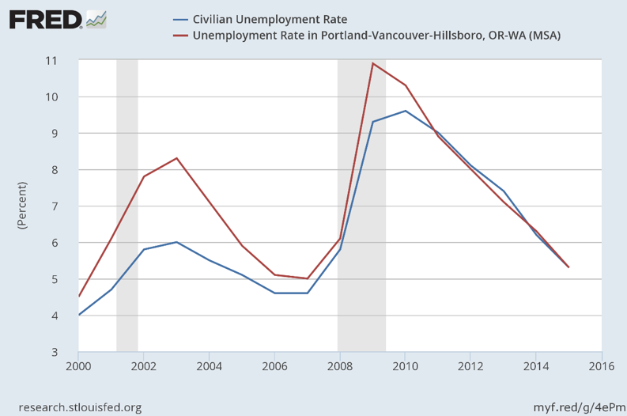

```{r setup, include=FALSE}
knitr::opts_chunk$set(echo = FALSE)
```

# Check-In

## Regional Profile due April 14

- Employment growth (from BEA)
- Unemployment rates (BLS)
- Per capita income (BEA)
- GDP per capita (BEA)
- Poverty rate (Census/ACS)
- Educational attainment levels (Census/ACS)

# Analyzing Regional Business Structure

## Firms and Industry

Two broad issues in business structure:

- Type/Size of firm
- Industry structure

## Businesses/Employment by Size and Type

- Employment by _firm_ (enterprise) size:
  - [https://www.census.gov/programs-surveys/susb.html](https://www.census.gov/programs-surveys/susb.html)
  - [https://www.sba.gov/advocacy/firm-size-data](https://www.sba.gov/advocacy/firm-size-data)
- Employment by _establishment_ size
  - County business patterns: [https://www.census.gov/programs-surveys/cbp/data.html](https://www.census.gov/programs-surveys/cbp/data.html)
  - BLS QCEW: [https://www.bls.gov/cew/](https://www.bls.gov/cew/)
  
##  Firm vs. Establishment

- Firms are decisionmaking units
- Establishments are physical locations
- Multi-establishment firms:
  - retailers and chain restaurants
  - branch plant facilities
  - specialized units- R&D, sales etc
- Different establishments within firms may be coded directly, especially if in different locations

##  Business by Firm Size, 2016

```{r, message=FALSE, warning=FALSE, include=FALSE}

if(!require(pacman)){install.packages("pacman"); library(pacman)}
p_load(readr, data.table, janitor, kableExtra)

susb <- fread("https://www2.census.gov/programs-surveys/susb/tables/2016/us_state_6digitnaics_2016.txt?#", header = TRUE, na.strings = "--", showProgress = TRUE)

us_total <- susb[STATEDSCR == "United States" & NCSDSCR == "Total"]

rm(susb)

us_total <- us_total[, list(FIRM, ESTB, EMPL_N, STATEDSCR, entrsizedscr)]

us_total <- clean_names(us_total, case = "snake")

us_tot_shares <- us_total[, `:=` (firm_share = firm/5954684,
                                  estab_share = estb/7757807,
                                  emp_share = empl_n/126752238)]

us_tot_shares <- us_tot_shares[, list(statedscr, entrsizedscr, firm, estb, empl_n, firm_share, estab_share, emp_share)]

fwrite(us_tot_shares, "lecture/presentation_tables/us_estab_sizes.csv")


#apparently the metro file does not include US total, so
#pull metro separately


baltimore <- fread("https://www2.census.gov/programs-surveys/susb/datasets/2015/msa_3digitnaics_2015.txt?#", header = TRUE, na.strings = "--", showProgress = TRUE)

baltimore <- baltimore[grepl(pattern = "Baltimore", x = MSADSCR) & NCSDSCR == "Total"]

baltimore <- baltimore[, list(MSADSCR, ENTRSIZE, FIRMTOT, ESTBTOT, EMPLTOT_N, entrsizedscr)]

baltimore <- clean_names(baltimore, case = "snake")

baltimore <- baltimore[, `:=` (firm_share = firmtot/53843,
                               estab_share = estbtot/66489,
                               emp_share = empltot_n/1139580)]

baltimore <- baltimore[, list(msadscr, entrsizedscr, firmtot, estbtot, empltot_n, firm_share, estab_share, emp_share)]

fwrite(baltimore, "lecture/presentation_tables/baltimore_estab_sizes.csv")
```

```{r, echo=FALSE, message=FALSE, warning=FALSE}

bmore_estab <- tibble::tribble(
      ~Size,   ~Firms,  ~Estabs, ~Employment,      ~Firms,     ~Estabs,   ~Employment,
    "Total", "53,843", "66,489", "1,139,580", "5,954,684", "7,757,807", "126,752,238",
      "0-4", "30,371", "30,403",    "49,351", "3,665,182", "3,671,901",   "5,923,452",
      "5-9",  "8,661",  "8,731",    "57,116", "1,013,878", "1,025,690",   "6,681,968",
    "10-19",  "5,620",  "5,783",    "74,811",   "626,900",   "657,781",   "8,432,521",
      "<20", "44,652", "44,917",   "181,278", "5,305,960", "5,355,372",  "21,037,941",
    "20-99",  "5,643",  "6,590",   "208,423",   "538,283",   "705,460",  "21,093,550",
  "100-499",  "1,549",  "3,059",   "162,357",    "90,742",   "367,446",  "17,783,726",
     "<500", "51,844", "54,566",   "552,058", "5,934,985", "6,428,278",  "59,915,217",
     "500+",  "1,999", "11,923",   "587,522",    "19,699", "1,329,529",  "66,837,021",
      "0-4",    "56%",    "46%",        "4%",       "62%",       "47%",          "5%",
      "5-9",    "16%",    "13%",        "5%",       "17%",       "13%",          "5%",
    "10-19",    "10%",     "9%",        "7%",       "11%",        "8%",          "7%",
      "<20",    "83%",    "68%",       "16%",       "89%",       "69%",         "17%",
    "20-99",    "10%",    "10%",       "18%",        "9%",        "9%",         "17%",
  "100-499",     "3%",     "5%",       "14%",        "2%",        "5%",         "14%",
     "<500",    "96%",    "82%",       "48%",      "100%",       "83%",         "47%",
     "500+",     "4%",    "18%",       "52%",        "0%",       "17%",         "53%"
  )

kable(bmore_estab, booktabs = TRUE) %>% 
  kable_styling() %>% 
  add_header_above(c(" " = 1, "Baltimore-Towson MSA" = 3, "United States" = 3)) %>% 
  pack_rows(index = c(" " = 9, "Percentage Shares" = 8))

rm(baltimore)
rm(bmore_estab)
rm(us_tot_shares)
rm(us_total)


```


##  Business/Employment by Size and Type

Employment by _firm_ size:
- [https://www.census.gov/programs-surveys/susb.html](https://www.census.gov/programs-surveys/susb.html)
- [https://www.sba.gov/advocacy/firm-size-data](https://www.sba.gov/advocacy/firm-size-data)

Employment by _establishment_ size:
- County Business Patterns: [https://www.census.gov/programs-surveys/cbp/data.html](https://www.census.gov/programs-surveys/cbp/data.html)
- QCEW: [https://www.bls.gov/cew/](https://www.bls.gov/cew/)

Employment by _firm type_:
- Census Bureau Nonemployer Statistics: [https://www.census.gov/programs-surveys/nonemployer-statistics/data.html](https://www.census.gov/programs-surveys/nonemployer-statistics/data.html)
- NETS: [http://youreconomy.org/](http://youreconomy.org/)

# Industrial Structure

##  Industry Employment

- The most common basis for analyzing regional economic structure
- Industry- what a particular worker (or establishment) makes/selss
  - Goods production 
    - Primary - agriculture, mining
    - Secondary - Manufacturing
  - Service Sector
- Generally, all workers in a particular "establishment" are generally counted in the same industry, regardless of what they do (occupation)

## Industry Coding

Standard Industrial Classification (SIC)- dominant system through the 1990s, replaced by NAICS in the early 90s. For historical industrial work, use SICs. But NAICS are now standard for North America (US, Canada, Mexico).

## NAICS 2-Digit Codes

```{r, echo=FALSE, message=FALSE, warning=FALSE}

naics <- tibble::tribble(
    ~Code,                                                            ~Industry.Title,
     "11",                               "Agriculture, Forestry, Fishing and Hunting",
     "21",                                                                   "Mining",
     "22",                                                                "Utilities",
     "23",                                                             "Construction",
  "31-33",                                                            "Manufacturing",
     "42",                                                          "Wholesale Trade",
  "44-45",                                                             "Retail Trade",
  "48-49",                                           "Transportation and Warehousing",
     "51",                                                              "Information",
     "52",                                                    "Finance and Insurance",
     "53",                                           "Real Estate Rental and Leasing",
     "54",                         "Professional, Scientific, and Technical Services",
     "55",                                  "Management of Companies and Enterprises",
     "56", "Administrative and Support and Waste Management and Remediation Services",
     "61",                                                     "Educational Services",
     "62",                                        "Health Care and Social Assistance",
     "71",                                      "Arts, Entertainment, and Recreation",
     "72",                                          "Accommodation and Food Services",
     "81",                            "Other Services (except Public Administration)",
     "92",                                                    "Public Administration"
  )


kable(naics, booktabs = TRUE) %>% 
  kable_styling() 


```

## Industry Coding

The NAICS codes are hierarchical so the more digits a code has the more specific the industry. As with everything, the more detail we want, the less likely we are to find available data. Six-digit NAICS employment numbers are hard to find even for many large MSAs.

## Industry Data Sources

```{r industry_data_sources, echo=FALSE, message=FALSE, warning=FALSE}

ind_data_source <- tibble::tribble(
                                                    ~Program,                ~Source,
                                  "County Business Patterns",        "Establishment",
                                      "ACS/Decennial Census",            "Household",
                                           "Economic Census",        "Establishment",
  "Local Employment Dynamics/\nQuarterly Workforce Indicators", "Establishment/Worker",
                  "Quarterly Census of Employment\n and Wages",        "Establishment",
                             "Current Employment Statistics",        "Establishment",
                      "Regional Economic Information System",        "Establishment"
  )


kable(ind_data_source, booktabs = TRUE) %>% 
  kable_styling()

```

## Industry Data Sources (cont.)

```{r industry_data_advatnages, echo=FALSE, message=FALSE, warning=FALSE}

data_source_benefits <- tibble::tribble(
                                                    ~Program,                                                                      ~Best.For,
                                  "County Business Patterns", "Downloading data for large number of metros, including by establishment size",
                                      "ACS/Decennial Census",                                     "Combining industry with demographic info",
                                           "Economic Census",                    "Combining with data such as value-added and output levels",
  "Local Employment Dynamics/Quarterly Workforce Indicators",                                                   "Detailed industry analysis",
                  "Quarterly Census of Employment and Wages",                     "Completeness, accurate, and timely (ish) industrial data",
                             "Current Employment Statistics",                                                                  "Very timely",
                      "Regional Economic Information System",                         "Consistent time series for broad industry categories"
  )

kable(data_source_benefits, booktabs = TRUE) %>% 
  kable_styling()


```

## Industry Data Sources (cont.)

```{r industry_data_disadvantage, echo=FALSE, message=FALSE, warning=FALSE}


disadvantages <- tibble::tribble(
                                                    ~Program,                                                          ~Limitations,
                                  "County Business Patterns",                    "Private Employment only; non-disclosure an issue",
                                      "ACS/Decennial Census",                                             "Lack of industry detail",
                                           "Economic Census",             "Not as timely (every 5 years), non-disclosure a problem",
  "Local Employment Dynamics/Quarterly Workforce Indicators", "(until recently) hard to access time series data, lack of US totals",
                  "Quarterly Census of Employment and Wages",                                       "Major non-disclosure problems",
                             "Current Employment Statistics",                              "Lack of geographic and industry detail",
                      "Regional Economic Information System",                                             "Lack of industry detail"
  )

kable(disadvantages, booktabs = TRUE) %>% 
  kable_styling()


```

##  Other Sources

State Labor Market Information (LMI) offices carry many BLS data sources for the state. May not be able to get unprocessed data, but sometimes a good place to start.

## Some other notes { .columns-2}

- When possible, remember to measure at similar points in the business cycle
  - Peak to peak
  - Trough to trough


