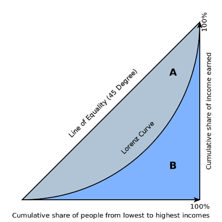

```{r setup, include=FALSE}
knitr::opts_chunk$set(echo = FALSE)

if(!require(pacman)){install.packages("pacman"); library(pacman)}
p_load(tidyverse, kableExtra)
```

## Today's Class

1.  Analyze economic specialization and diversification
2.  What we can we surmise about the growth in our industries?
  + We will break down industry growth/decline to determine more about the regional dynamics that determine industrial change
3.  Calculating and interpreting shift-share analysis

# Specialization and diversification

##  What is it?

Regions' economies change over time and this has consequences for future growth and prosperity. Is your region dependent on one industry? Is it diversified? Is it especially competitive, or weak, in any industrial areas?

## Some Measures...Coefficient of Specialization

Popularized by Walter Isard, also known as the "Krugman Dissimilarity Index"

Basic idea-Halved sum of absolute deviations between regional and national shares across industries (basically a dissimilarity index)
- Reflects _share of regional employment that would have to be redistributed to match the national profile_

$$  Dis_{AB} = 1/2 * \Sigma \lvert a_i - b_i \rvert $$

a = share of employment for local location
b = share of employment for nation

Values range from 0 (perfect similarity) to 1 (perfect dissimilarity)

## Coefficient of Specialization (cont.)

There is also an index of localization that is the **sum** of absolute deviations of an industry across regions relative to overall employment

## Coefficient of Specialization (cont.)

| Ref      | A   | B   | C    |      | A   | B         | C         |           |
|----------|-----|-----|------|------|-----|-----------|-----------|-----------|
| Industry | %   | %   | %    | %    |     | Deviation | Deviation | Deviation |
| 1        | 0.2 | 0.2 | 0.3  | 0.5  |     | 0         | 0.1       | 0.3       |
| 2        | 0.2 | 0.2 | 0.1  | 0.05 |     | 0         | 0.1       | 0.15      |
| 3        | 0.2 | 0.2 | 0.2  | 0.1  |     | 0         | 0         | 0.1       |
| 4        | 0.2 | 0.2 | 0.35 | 0.2  |     | 0         | 0.15      | 0         |
| 5        | 0.2 | 0.2 | 0.05 | 0.15 |     | 0         | 0.15      | 0.05      |
|----------|-----|-----|------|------|-----|-----------|-----------|-----------|
| Total    | 1   | 1   | 1    | 1    | COS | 0         | 0.25      | 0.3       |

Table: Example Coefficient of Specialization table

## Hirschman-Herfindahl Index (HHI)

* Index used to measure industrial concentration (was primarily used in anti-trust cases historically)
* Sums the squared shares of parts within the whole
  + firms within industry
  + industries within region
  
$$ H = \sum_{i = 1}^{N} s_{i}^2 $$
## HHI Example (as borrowed from Wikipedia) { .smaller}

Assume we have 10 firms producing some good in a region. We shall assume that 3 of the firms produce 90% of the output and the remaining 10% is evenly distributed across the other firms.

In our second case let's assume one firm produces 90%.

\begin{footnotesize}

Competitive (ish) market: $ (0.30^2 + 0.30^2 + 0.30^2) + (0.014^2 + 0.014^2 + 0.014^2 + 0.014^2 + 0.014^2 + 0.014^2 + 0.014^2) = 0.271 (27.1%)$

Non-Competitive Market: $ (.9^2) + 9 * 0.11^2 = 0.9189 (91.9%) $

\end{footnotesize}

From [Wikipedia](https://en.wikipedia.org/wiki/Herfindahl_index)

## Spatial Gini Coefficient

Gini coefficient is widely used measure of inequality

Variation along the "Lorenz Curve"- cumulative % of incomes

Ellison and Glaeser applied the idea to regional economies using the _sum of squared deviations from the reference region_

## Spatial Gini (cont.)



## Ellison and Glaeser Index (EG)

$$ EG = \frac{\Sigma (s_i - x_i)^2 - (1 - \Sigma_i x_i^2)H}{(1 - \Sigma_i x_i^2)(1 - H)} $$
