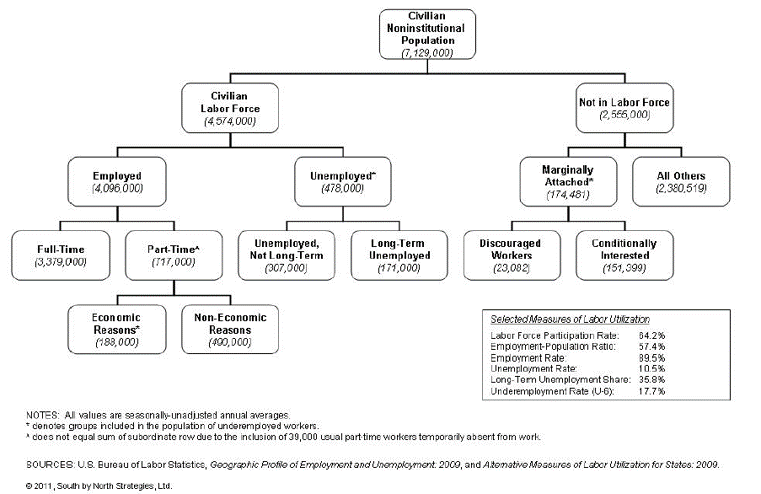
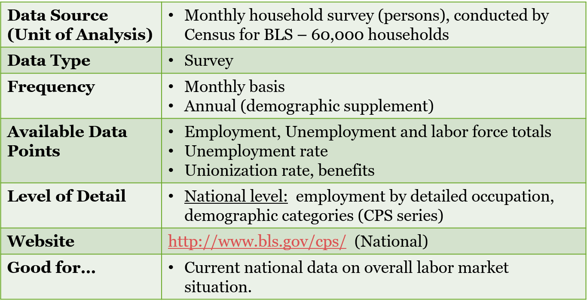
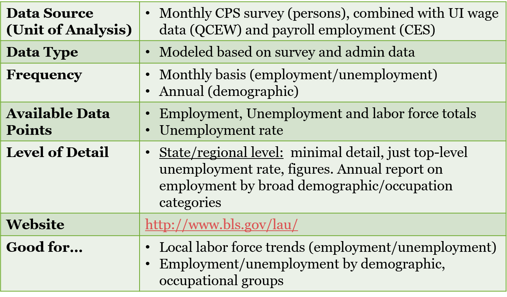
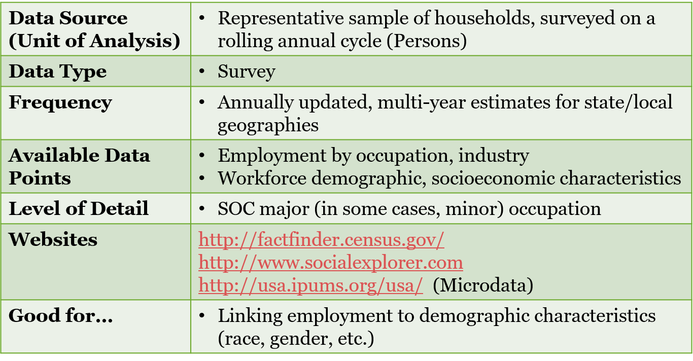
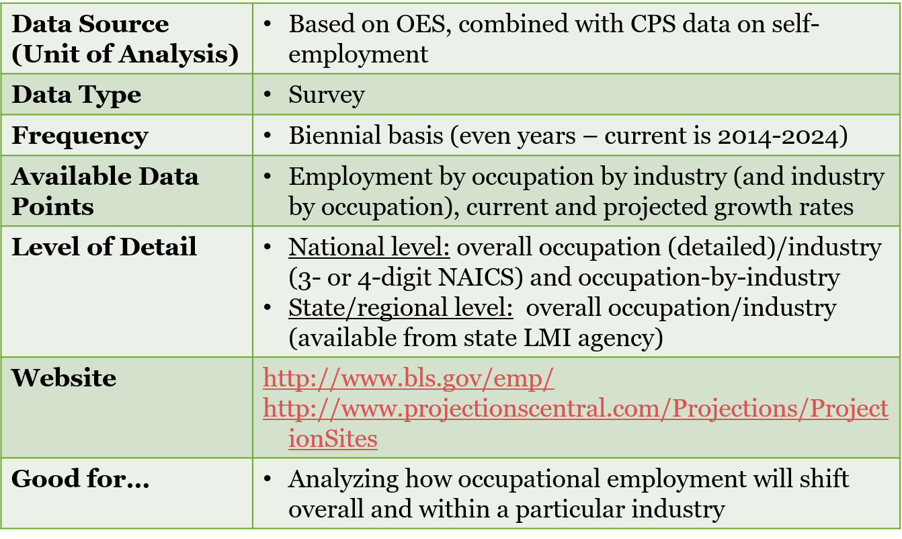

## Check-in And Update

1. We are halfway through. How is everyone feeling? Is the R becoming easier to understand? What issues still puzzle you?

2.  As I mentioned on the website I will introduce PUMS over the next few weeks. The PUMS are *complex*, by design, and I do not expect you all to be experts, but being familiar with the potential microdata will take your analysis to next level. 

3.  Resources...is everyone making progress in DataCamp? Has anyone gone to the recommended guides in the syllabus ([R4DS](https://r4ds.had.co.nz/), [R Graphics Cookbook 2nd Edition](https://r-graphics.org/))?

4. What can I do to make the labs/lectures more understandable or approachable?

---

# Introduction

---

##  Analyzing Your Regional Labor Market

* What are the rates of labor market participation in my region across different groups?

* What sectors of the economy are people working in?

* What is the occupational composition of my regional workforce?

* How do occupational wages compare in my region to the nation? What jobs are projected to grow? 

---

## Labor Force Status




---

## BLS: Current Population Survey (CPS)




---

##  BLS: Local Area Unemployment Statistics




---

##  Census: American Community Survey



---


## Unemployment Rate by Race/Ethnicity, 2014-2018

```{r tidycensus_start, echo=FALSE, message=FALSE, warning=FALSE, results='asis'}

if(!require(pacman)){install.packages("pacman"); library(pacman)}
p_load(tidycensus, dplyr, ggplot2, ggthemes, hrbrthemes)

# var_tab <- load_variables(year = 2018, dataset = "acs5/subject", cache = TRUE)

emp_status <- get_acs(geography = "metropolitan statistical area/micropolitan statistical area",year = 2018, variables = c("White NH" = "S2301_C04_012",
                                                                                      "Black NH" = "S2301_C04_013", "Amer. Indian NH" = "S2301_C04_014", "Asian NH" = "S2301_C04_015", "Native Hawaiian NH" = "S2301_C04_016", "Other NH" = "S2301_C04_017",
"Two or more NH" = "S2301_C04_018", "Hispanic/Latinx" = "S2301_C04_019"))

emp_status_us <- get_acs(geography = "us",year = 2018, variables = c("White NH" = "S2301_C04_012",
                                                                                      "Black NH" = "S2301_C04_013", "Amer. Indian NH" = "S2301_C04_014", "Asian NH" = "S2301_C04_015", "Native Hawaiian NH" = "S2301_C04_016", "Other NH" = "S2301_C04_017",
"Two or more NH" = "S2301_C04_018", "Hispanic/Latinx" = "S2301_C04_019"))

bmore_emp <- emp_status %>% 
  filter(GEOID == "12580") %>% 
  bind_rows(emp_status_us) 

ggplot(bmore_emp, aes(variable, estimate, fill = NAME)) +
  geom_bar(stat = "identity", position = "dodge") +
  labs(x = "Race/Ethnicity", y = "") +
  scale_y_continuous(labels = scales::percent) + 
  geom_errorbar(aes(ymin = estimate - moe, ymax = estimate + moe),  width = .75, position = "dodge") +
  coord_flip() +
  theme_minimal() +
  theme(legend.position = "bottom")

```


\footnotetext[1]{Source: ACS 2014-2018, table = S2301}


# What sectors of the economy are people working in?

---

## Class of Worker

Private for-profit

  - Employee of a private company
  - Self-employed incorporated

Private not-for-profit

Government

  - Local
  - State
  - Federal

Self-employed in unincporporated business

---

## Class of Worker


```{r class_worker, echo=FALSE, message=FALSE, warning=FALSE}

worker_class <- get_acs(geography = "metropolitan statistical area/micropolitan statistical area", variables = c("Total Emp." = "S2408_C01_001", "Private, for-profit" = "S2408_C01_002", "Private, not-for-profit" = "S2408_C01_005", "Local Gov." = "S2408_C01_006", "State Gov." = "S2408_C01_007", "Federal" = "S2408_C01_008", "Self Employed" = "S2408_C01_009"), year = 2018)

worker_class <- worker_class %>% 
  mutate(class_share = estimate/1401968)

worker_class_us <- get_acs(geography = "us", variables = c("Total Emp." = "S2408_C01_001", "Private, for-profit" = "S2408_C01_002", "Private, not-for-profit" = "S2408_C01_005", "Local Gov." = "S2408_C01_006", "State Gov." = "S2408_C01_007", "Federal" = "S2408_C01_008", "Self Employed" = "S2408_C01_009"), year = 2018)

worker_class_us <- worker_class_us %>% 
  mutate(class_share = estimate/152739884)

worker_class_bmore <- worker_class %>% 
  filter(GEOID == "12580") %>% 
  bind_rows(worker_class_us) %>% 
  filter(variable != "Total Emp.")

worker_class_bmore <- worker_class_bmore %>% 
  mutate(variable = factor(variable, levels = c("Private, for-profit", "Private, not-for-profit", "Local Gov.", "State Gov.", "Federal", "Self Employed")))

ggplot(worker_class_bmore, aes(variable, class_share, fill = NAME)) +
  geom_bar(stat = "identity", position = "dodge") +
  labs(x = "Employment Status", y = "") +
  scale_y_continuous(labels = scales::percent) + 
  coord_flip() +
  theme_minimal() +
  theme(legend.position = "bottom")


```

\footnotetext[2]{Source: ACS 2013-2017, table = S2408}

---

## Census: EEO Data

Equal Employment Opportunity Tables

Detailed breakdown of occupational demographics by race, gender, citizenship status etc

Potentially very powerful but *VERY* out of date (2010 latest tabulations) and can reproduce most of it with ACS microdata

[Census EEO](https://www.census.gov/topics/employment/equal-employment-opportunity-tabulation/guidance.html)


# Occupational Composition and Wages

---

##  Occupational Coding: Standard Occupational Classification System (SOC)


23 major groups and 840 detailed occupations

---

## BLS: Occupational Employment Statistics (OES)

* Get occupational composition and wage rates down to MSA and non-metropolitan areas.
* Cross-industry data available at *national* level
* Median wage and hourly wage data available in addition to empoyment estimates

*Note*- this data is also available in the PUMS

---

# Employment Projections

---

##  BLS: Occupational Employment Projections




# Intro. to PUMS

---

##  The Plan...

Over the next few weeks we will be discussin and covering PUMS, and its attendant advatnages, disadvantages and issues

Today we will *NOT* be doing any PUMS analysis in R. Just overview. Ideally next week we will start with data collection and basic usage in R.

---

##  What is it?

The PUMS (Public Use Microdata Sample) gives us the *individual* survey responses to the ACS

Has 1% and 5% samples

Data comes in individual and household estimates that have individual weights

---

## Why use PUMS?

* Data not available in the standard tables
  - Example: occupation by sex by marital status
* Can create new variable measures i.e. spousal occupation
* Desire to conduct statistical analyses with census data

## PUMS Geographies

PUMS comes in census region, division, state and PUMA only (from census)

  * IPUMS does provide MSA and county estimates, but note the geographies may not be consistent
  
## PUMAs- Public Use Microdata Areas

* Geography with 100k+ population
* Has a five digit code
* Designed to nest within states

## Accessing PUMS data

You can access through Census **BUT** a better way is through [IPUMS](https://usa.ipums.org/usa/) through U. MN.

IPUMS has normalized Census microdata going back to the 19th century and also offers other microdata like the CPS, ATUS and international microdata series

## Getting Set-Up on IPUMS

Go to IPUMS website and register. Experiment with the online apps and run some descriptive stats. Download the [Abacus](https://usa.ipums.org/usa/abacus.shtml) app if you want access to IPUMS ACS data at your fingertips

